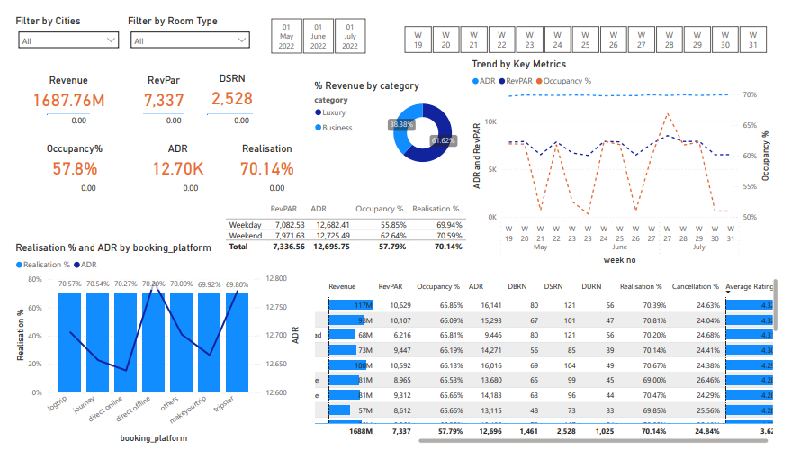
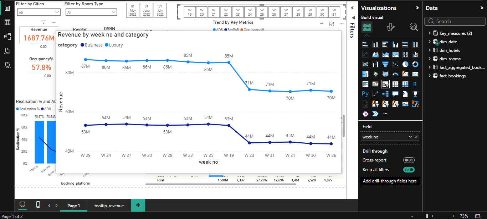
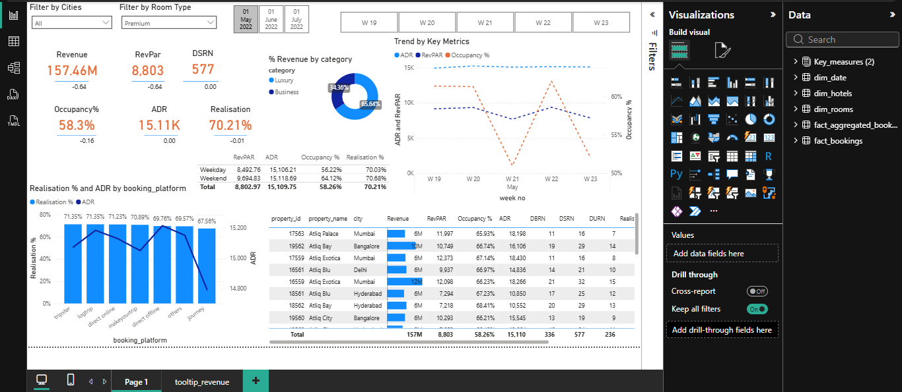

# Hospitality Business Performance Dashboard

## Project Overview
This project presents an interactive Power BI dashboard designed to analyze and improve the performance of a hospitality business.  
It focuses on key metrics such as revenue, occupancy, booking platforms, and customer behavior to enable data-driven decision-making.

## Tech Stack
- Power BI – Data visualization and dashboard creation  
- DAX (Data Analysis Expressions) – KPI calculations  
- Power Query – Data cleaning and transformation  

## Key Performance Indicators (KPIs)
- Revenue  
- RevPAR (Revenue per Available Room)  
- ADR (Average Daily Rate)  
- Occupancy %  
- Realisation %  
- Cancellation %  
- Average Rating  

## Dashboard Features

### Business Problem
Hospitality businesses often struggle to track and optimize performance due to scattered data across booking platforms, inconsistent occupancy trends, and lack of real-time insights.

### Goal of the Dashboard
- Provide a centralized view of business performance  
- Monitor key KPIs like Revenue, Occupancy, and RevPAR  
- Identify trends and patterns across time, cities, and platforms  
- Support strategic decision-making to improve revenue and efficiency  

### Walkthrough of Key Visuals
- KPI Cards (Top Section): Display overall performance metrics like Revenue, ADR, Occupancy %, and Realisation %  
- Trend Analysis Chart: Shows weekly trends of ADR, RevPAR, and Occupancy % (May–July)  
- Revenue by Category: Compares performance between Luxury and Business segments  
- Booking Platform Analysis: Evaluates Realisation % and ADR across different platforms  
- Weekday vs Weekend Table: Highlights differences in occupancy and revenue patterns  
- Filters (Slicers): Allow users to analyze data by City and Room Type  

### Business Impact and Insights
- Weekend bookings generate higher occupancy and RevPAR compared to weekdays  
- Luxury category contributes a major share of total revenue  
- Occupancy trends remain stable across weeks, indicating consistent demand  
- Booking platform comparison helps evaluate performance efficiency  
- Enables better pricing and revenue optimization decisions  

## Key Business Questions Answered
- Which category (Luxury or Business) generates more revenue?  
- How does occupancy vary across weeks and months?  
- Which booking platform performs best in terms of Realisation %?  
- What is the difference between weekday and weekend performance?  
- How do ADR and RevPAR trends change over time?  
- Are there any patterns in customer ratings and cancellations?  

## Dashboard Preview

### Main Dashboard

### Additional Views

## Learnings
- Developed advanced DAX measures for KPI tracking  
- Performed data cleaning and transformation using Power Query  
- Built interactive dashboards for business analytics  
- Gained understanding of hospitality domain metrics  

## Future Enhancements
- Add forecasting models for revenue prediction  
- Integrate real-time data sources  
- Deploy dashboard using Power BI Service  

---

If you find this project useful, consider starring the repository.
